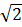
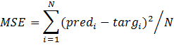

# AnalyticalFormulas

**Назначение и общее описание**

Программа моделирует выход относительно входа, используя и подбирая для
этого аналитические формулы. Для обучения применяется комплексный
подход: сами формулы подбираются с использованием генетического
алгоритма, при этом значения параметров подбираются с помощью
оптимизатора (градиентный спуск).

Характеристика и структура программы:

-   Для нахождения формул используется генетический алгоритм (набор особей).
    
-   Каждая особь -- это дерево вычислений для соответствующей аналитической формулы. Т.е. дерево м.б. представлено  аналитической формулой и наоборот.
    
-   Дерево состоит из вершин. Каждая вершина хранит информацию: о связях с другими вершинами, вычисляемой операции (функции), индексе данных и типе вершины. Типы вершин могут быть следующими:
    
    -   [o = ] Операция (вычисляемая функция)

    -   [x = ] Значение входного вектора

    -   [w = ] Значение веса

    -   [c = ] Константа.

-   Операции дерева подбираются с помощью генетических операторов.

-   Веса дерева обучаются с помощью оптимизатора scipy.optimize.

-   Константы дерева не могут быть обучены, но могут подбираться из установленного списка значений генетическим алгоритмом.
    
-   Для дерева можно использовать типовой набор операций: сложение, вычитание, умножение, деление, синус ([sin]{lang="en-US"}), косинус ([cos]{lang="en-US"}), тангенс ([tanh]{lang="en-US"}), арктангенс ([arctg]{lang="en-US"}), кардинальный синус ([sinc]{lang="en-US"}), функция Гаусса. Этот набор можно расширить своими (пользовательскими) операциями.
    
-   У операции предусмотрено использование любого количества аргументов. У каждой операции количество аргументов необходимо указывать явно. Особо выделены следующие типы операций:
    
    -   1 аргумент -- унарные операции (функции, например, тангенс)

    -   2 аргумента -- бинарные операции (например, арифметические
    операции)
    
    -   3 аргумента -- тернарные операции (например, операции сравнения)

-   По умолчанию предусмотрен следующий список констант: -1, 0, 1, 1.41421356237 (), 2, 2.7182818284 ([e]{lang="en-US"}), 3, 3.1415926535 (π). Можно использовать свой (пользовательский) набор констант, но в них в обязательном порядке д.б. следующие значения (опорный вектор значений): 0, 1, 2, -1.

\
\

**Генетический алгоритм**

Процедура (метод FormulaPopulation.recombine):

1.  Подсчитать ранг и сортировать всех особей по рангу

2.  Исключить более низкий процент особей из племенного пула

3.  Передать верхний процент особей в дочернюю популяцию без изменений

4.  Выбор особей турнирным методом

5.  Создание новой популяции через кроссовер и мутацию.

\
\

**Метрики оценки популяции**

Для оценки популяции используются следующие метрики:

-   Сложность (complexity\_target) -- вычисляется на основе сложности операций, составляющих дерево вычислений.
    
-   Средняя среднеквадратичная оценка [MSE]{lang="en-US"} ([ftarget]{lang="en-US"}) = [min]{lang="en-US"}([MSE]{lang="en-US"})
    
-   Минимальная среднеквадратичная оценка [MSE]{lang="en-US"} ([ftarget]{lang="en-US"}\_[min]{lang="en-US"}) = [mean]{lang="en-US"}([MSE]{lang="en-US"})

Затем в популяции проводится ранжирование по доминированию Парето. Выбор пар метрик вероятностно регулируется параметром FormulaPopulation.alg\_probMoo (=0,8):

1.  Тип: mean-complexity. Средняя среднеквадратичная оценка -- Сложность. Выбирается с вероятностью alg\_probMoo.
    
2.  Тип: mean-min. Средняя среднеквадратичная оценка -- Минимальная среднеквадратичная оценка. Выбирается с вероятностью 1 - alg\_probMoo.

[]{#_GoBack}\
\

**Правила сокращения**

Опционально при подборе формулы можно использовать сокращение размера дерева вычислений. Для сокращения размера формул (reduction) используются следующие правила:

-   Сложение одинаковых весов, констант, входных переменных: [x]{lang="en-US"} + [x]{lang="en-US"} → 2 \* [x]{lang="en-US"}
    
-   Вычитание одинаковых весов, констант, входных переменных: [x]{lang="en-US"} - [x]{lang="en-US"} → 0
    
-   Деление одинаковых весов, констант, входных переменных: [x]{lang="en-US"} / [x]{lang="en-US"} → 1
    
-   Сложение с нулём: [x + 0 ]{lang="en-US"}→[ x]{lang="en-US"}

-   Вычитание из нуля: 0 -- [x ]{lang="en-US"}→[ -1 \* x]{lang="en-US"}

-   Вычитание нуля: [x -- 0 ]{lang="en-US"}→[ x]{lang="en-US"}

-   Умножение на единицу: 1 \* [x ]{lang="en-US"}→[ x]{lang="en-US"}

-   Деление на единицу: [x]{lang="en-US"} / 1 → [x]{lang="en-US"}

\
\

**Конвертация и строковое представление**

Дерево вычислений м.б. преобразовано в строку несколькими способами:

-   Преобразование дерева в строку с заменой констант на числа
    (to\_strw)

-   Преобразование дерева в строку с заменой весов и констант на числа
    (to\_str).

\
\

**Пример использования**

Код для обучения популяции на входных данных [inp]{lang="en-US"}, чтобы смоделировать выходные данные [targ]{lang="en-US"}. 100 итераций эволюционного алгоритма, в каждой итерации используется оптимизация весов (20 итераций). В конце применяется оптимизация весов -- 100 итераций.

[import numpy as np]{lang="en-US"}

[my\_prob = np.ones(len(FUNC\_OPERATIONS), dtype=int)]{lang="en-US"}

[fp = FormulaPopulation(input\_num=1, weights\_num=2,
my\_func=FUNC\_OPERATIONS, my\_prob=my\_prob)]{lang="en-US"}

[fp.start\_popul(30)]{lang="en-US"}

[fp.runfit(inp, targ, iterfit=20, iter=100)]{lang="en-US"}

[fp.runfit(inp, targ, iterfit=100)]{lang="en-US"}

\
\

Код для предсказания значений популяцией.

[pred]{lang="en-US"} = [fp]{lang="en-US"}.predict([inp]{lang="en-US"})

\
\

**Классы и методы**

[FormulaVertex]{.underline} - Класс вершины дерева операций. Хранит информацию: о связях с другими вершинами, вычисляемой функции, индексе данных и типе вершины.

Аргументы класса:

-   func - (function) - Вычисляемая функция.

-   typeval - (Str) - Тип вершины:

    -   x - значение входного вектора

    -   w - значение веса

    -   с - константное значение

    -   \- выполнение операции.

-   indexval - (int) - Индекс значения: либо входного вектора, либо вектора весов, либо вектора констант.
    
-   rel1, rel2, rel3 - (FormulaVertex) - Связи с другими вершинами.

Методы класса:

-   del\_relations - Удалить связи

-   add\_relation - Вставить новую связь

-   add - Добавить связь в конец

-   vertex\_index - Найти смежную вершину

-   update\_relation\_num - Обновить используемое количество связей

-   calc - Расчёт дерева операций

-   complexity - Вычисление сложности дерева операций

-   update\_oper - Обновление индекса операций

-   update\_connect - Обновление индекса связей

-   get\_ids - Вернуть ID

-   reduction\_req - Рекурсивное сокращение операций

-   reduction - Сокращение операций

-   set\_func - Установить функцию

-   del\_vertex - Удалить текущую вершину

-   set\_const - Установить константу

-   eq\_two - Проверка на одинаковые значения бинарных операций

-   eq\_const - Проверка значения константы

-   str\_one - Преобразование унарных (и префиксных) операций в строку

-   str\_two - Преобразование бинарной операции в строку

-   str\_three - Преобразование тернарной операции в строку

-   str\_vertex - Вывод только текущей вершины

\
\

[FormulaTree]{.underline} - Дерево операций, состоящие из вершин FormulaVertex.

Аргументы класса:

-   base - (FormulaVertex) - Корень дерева.

-   weights - (ndarray) - Вектор весов.

-   weights\_num - (int) - Если вектор весов не задан, инициализирует
    нулевой вектор весов.

-   input\_num - (int) - Количество входов.

-   constants - (list) - Список констант. Если не задан, по умолчанию берутся константы CONSTANTS\_OPERATIONS.

Методы класса:

-   get\_rand\_weight (staticmethod) - Вернуть случайный вес от -2 до +2

-   set\_data - Задать данные для расчётов

-   init\_weight - Инициализация дерева одним общим весом

-   init\_weights - Инициализация весов дерева

-   predict - Расчёт дерева операций

-   targetfun - Целевая функция

-   targetfun\_opt - Целевая функция для оптимизации

-   target\_mse - Метрика MSE

-   target\_rmse - Метрика RMSE

-   complexity - Вычисление сложности дерева операций

-   total\_target - Целевая функция, учитывающая сложность

-   fit - Обучение весов дерева

-   update\_oper - Обновление индекса операций

-   update\_connect - Обновление индекса связей

-   update\_index - Обновление всех индексов

-   clear\_index - Очистить индекс

-   check\_index - Проверка индексов

-   get\_ids - Массив идентификаторов

-   reduction - Сокращение операций

-   to\_str\_oper - Вывод индексов операций

-   to\_str\_connect - Вывод индексов соединений

-   to\_strw - Преобразование дерева в строку

-   to\_str - Преобразование дерева в строку с заменой весов на числа

\
\

[[FormulaTreePopul]{.underline}]{lang="en-US"} - Дерево-особь для использования в генетическом алгоритме. Наследует класс FormulaTree.

Аргументы класса:

-   my\_func - (list) - Список допустимых функций.

-   my\_args - (list) - Количество аргументов у соответствующих функций.

-   my\_prob - (list) - Задаёт важность использования соответствующих
    функций (в условных единицах).

-   input\_num - (int) - Количество входов.

-   weights\_num - (int) - Задаёт вектор весов.

-   constants - (list) - Список констант. Если не задан, по умолчанию
    берутся константы CONSTANTS\_OPERATIONS.

Методы класса:

-   init\_popul - Инициализация дерева

-   start\_popul - Создание стартовой популяции

-   rand\_func - Случайная функция из предложенного массива

-   rand\_change\_oper - Изменение случайной операции дерева

-   new\_relation - Создание новой связи

-   new\_vertex - Новая вершина

-   add\_vertex - Добавление новой вершины в дерево

-   rand\_add\_vertex - Добавление случайной вершины

\
\

[[FormulaPopulation]{.underline}]{lang="en-US"} - Популяция особей: оптимизация весов, генетический алгоритм, обучение и предсказание.

Аргументы класса:

-   input\_num - (int) - Количество входов.

-   weights\_num - (int) - Задаёт вектор весов.

-   constants - (list) - Список констант. Если не задан, по умолчанию
    берутся константы CONSTANTS\_OPERATIONS.

-   my\_func - (list) - Список допустимых функций. Если не задан, по
    умолчанию берутся функции FUNC\_OPERATIONS.

-   my\_prob - (list) - Задаёт важность использования соответствующих
    функций (в условных единицах). Если не задан, по умолчанию важность
    одинакова (1/len(my\_func)).

-   weights\_popul - (int) - Количество испытаний, проведённых с одной
    особью.

-   prob\_func - (float) - Вероятность изменения операции дерева в
    особи.

-   prob\_vertex - (float) - Вероятность добавления новой вершины в
    особь.

-   prob\_crossover - (float) - Вероятность применения кроссовера к
    особи.

-   cull\_ratio - (float) - Отбор - устранение худших особей из
    племенного пула.

-   elite\_ratio - (float) - Элитарность - сохранить лучших особей без
    изменений.

-   alg\_probMoo - (float) - Методика ранжирования по Парето:
    mean-complexity или mean-min.

-   prob\_reduction - (float) - Вероятность сокращения операций в особи.

-   lmd - (float) - Коэффициент общей целевой функции.

Методы класса:

-   init\_popul - Инициализация популяции

-   start\_popul - Создание стартовой популяции

-   start\_popul\_func - Создание стартовой популяции по функции

-   check\_index - Проверка индексов

-   crossover (staticmethod) - Кроссовер

-   multi\_targetfun - Оценка популяции по разным весам

-   targetfit - Обучение популяции

-   probMoo - Ранжирование

-   rank\_sort - Сортировка всех особей по рангу

-   tournament - Выбор особей турнирным метогдом

-   cull\_elite - Исключение низших особей и передача высших без
    изменений

-   recombine - Следующее поколение особей

-   reduction - Сокращение операций

-   ask - Этап эволюции особей

-   askfit - Этап эволюции особей

-   sort - Последнее ранжирование популяции

-   run - Запуск оптимизации

-   runfit - Запуск оптимизации

-   fit - Обучение весов дерева

-   predict - Предсказание

-   support - Нахождение опорных значений

-   get\_weights - Все веса популяции

-   print\_iter - Информация про выполнение итерации

-   check\_set - Проверка пересечений

-   to\_str - Преобразование популяции в строку с заменой весов на числа

\
\

**Доступные по умолчанию функции дерева операций**

-   fsum - Сложение

-   fsub - Вычитание

-   fmul - Умножение

-   fdev - Деление

-   fsin - Синус

-   fcos - Косинус

-   ftanh - Тангенс

-   farctan - Арктангенс

-   fsinc - Кардинальный синус

-   fgauss - Функция Гаусса

\
\

**Глобальные константы**

-   FUNC\_OPERATIONS - Список используемых по умолчанию операций дерева (все функции)
    
-   ARGS\_OPERATIONS - Количество аргументов для соответствующих операций
    
-   STR\_OPERATIONS - Строковое обозначение для соответствующих операций

-   COMPL\_OPERATIONS - Значение сложности для соответствующих операций

-   TWO\_OPERATIONS - Бинарные операции

-   THREE\_OPERATIONS - Тернарные операции

-   CONSTANTS\_OPERATIONS - Список используемых по умолчанию констант.

\
\

::: {type="FOOTER"}
11

\
:::
